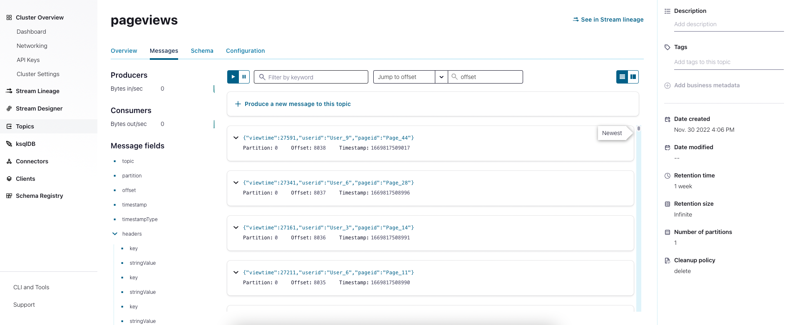

# Start a self-managed Kafka Connector with Confluent for Kubernetes in Azure Kubernetes Service

In Confluent Cloud, one can use fully-managed connectors. If you prefer to run your connectors by yourself, here is a way to run self-managed connectors against Confluent Cloud.

This is an example with the Datagen Connector that generates data into a Kafka topic in Confluent Cloud. The connector itself is deployed with Confluent for Kubernetes on Azure Kubernetes Service.

## Prerequisites

0. Install Azure CLI, HELM & Kubernetes CLI
```
# Install with Homebrew
brew update
brew install azure-cli 
brew install helm
brew install kubectl
```

1. Deploy AKS cluster in Azure

```
# Login to Azure
az login

# Create Resource group
az group create --name <group-name> --location westeurope --tags owner_email=<email>

# Create AKS cluster
az aks create \                                                                           
    --resource-group <group-name> \      
    --name <cluster-name> \
    --node-count 10 --generate-ssh-keys --tags owner_email=<email>
```

Configure kubectl to connect to your Kubernetes cluster:
```
az aks get-credentials --resource-group <group-name> --name <cluster-name>

# Verify the connection to your cluster
kubectl get nodes
```

2. Deploy Confluent Operator in AKS

```
# Create a namespace
kubectl create namespace confluent

# Set namespace as default for Kubernetes context
kubectl config set-context --current --namespace confluent
```
Install Confluent for Kubernetes
```
# Set up the Helm Chart
helm repo add confluentinc https://packages.confluent.io/helm
helm repo update

# nstall Confluent For Kubernetes using Helm
helm upgrade --install confluent-operator confluentinc/confluent-for-kubernetes

# Check that the Confluent For Kubernetes pod comes up and is running
kubectl get pods -n confluent
```

## Deploy Self-Managed Connector

**Provide authentication credentials**

- Confluent Cloud provides you an API key for both Kafka and Schema Registry. Configure Confluent For Kubernetes to use the API key when setting up Connect and ksqlDB to connect
- Create a Kubernetes secret object for Confluent Cloud Kafka access. This secret object contains file based properties. These files are in the format that each respective Confluent component requires for authentication credentials

```
kubectl create secret generic ccloud-credentials \
--from-file=plain.txt=ccloud-credentials.txt

# Also create secret in basic format for topic creation
kubectl create secret generic ccloud-credentials-basic \
--from-file=basic.txt=ccloud-credentials.txt

kubectl create secret generic ccloud-sr-credentials \
--from-file=basic.txt=ccloud-sr-credentials.txt
```

**Deploy self-managed Kafka Connect cluster**

Edit the kafka-connect.yaml deployment YAML, and add your respective Confluent Cloud URLs in the following places:

- ```<cloudSR_url>```
- ```<cloudKafka_url>```

Deploy Confluent Platform with the above configuration
```
kubectl apply -f kafka-connect.yaml
```

Edit the create-topic.yaml deployment YAML, and add your respective Confluent Cloud identifier and endpoint in the following places:

- ```<REST_endpoint>```
- ```<cluster_ID>```

Create Kafka topic in Confluent Cloud
```
kubectl apply -f create-topic.yaml
```

Deploy Datagen Connector
```
kubectl apply -f connector.yaml
```

Check that all Confluent resources are deployed
```
kubectl get pods
kubectl get connector
kubectl get topic
```

**Head to Confluent Cloud and check the pageviews topic messages**



## Cleanup

```
kubectl delete -f connector.yaml
kubectl delete -f create-topic.yaml
kubectl delete -f kafka-connect.yaml

kubectl delete secrets ccloud-credentials ccloud-credentials-basic ccloud-sr-credentials

helm delete operator
```
